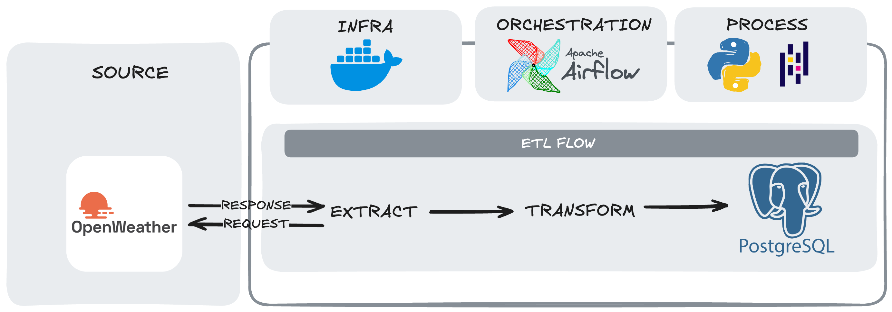

# Pipeline ETL: Monitoramento Meteorológico (Rio de Janeiro)

Este projeto implementa um pipeline de dados automatizado que coleta, processa e armazena informações climáticas em tempo real da cidade do Rio de Janeiro, utilizando a API OpenWeatherMap como fonte primária.

## O que este projeto resolve?

O objetivo foi criar uma infraestrutura de dados robusta e resiliente capaz de:
- **Automatizar a ingestão**: Coleta periódica de dados meteorológicos sem intervenção manual.
- **Garantir a Idempotência**: Sistema de carga que permite reexecuções sem duplicidade de dados ou corrupção do histórico.
- **Padronizar dados brutos**: Transformação de JSONs complexos e aninhados em tabelas relacionais limpas e prontas para análise.
- **Monitoramento e Orquestração**: Visibilidade total sobre o sucesso ou falha de cada etapa do pipeline (Extração, Transformação e Carga).

## Tech Stack

- **Python 3.12+**: Linguagem base para o desenvolvimento da lógica de ETL.
- **Apache Airflow**: Motor de orquestração responsável pelo agendamento e monitoramento das tarefas.
- **PostgreSQL**: Banco de dados relacional utilizado para o armazenamento persistente dos dados transformados.
- **Docker & Docker Compose**: Containerização de todo o ambiente, garantindo portabilidade e isolamento de dependências.
- **Pandas**: Biblioteca principal para manipulação, limpeza e normalização dos dados.
- **SQLAlchemy**: Engine de conexão e interface de alto nível com o banco de dados.

## Arquitetura do Pipeline



## Estrutura do Projeto

```text
pipeline_etl_dados_climaticos/
├── config/              # Configurações e variáveis de ambiente (.env)
├── dags/                # Definição da DAG e orquestração das tarefas
├── src/                 # Núcleo técnico (scripts de Extração, Transformação e Carga)
├── data/                # Datalake local para auditoria de arquivos JSON e CSV
├── notebooks/           # Análise exploratória e prototipação do pipeline
├── tests/               # Estrutura para implementação de testes unitários
├── assets/              # Evidências e diagramas (ex: arquitetura do pipeline)
└── docker-compose.yaml  # Orquestração de containers (Airflow + Postgres)
```

## Como Executar

### Ambiente Dockerizado (Airflow) - Recomendado

1. **Clone o repositório:**
   ```bash
   git clone https://github.com/seu-usuario/pipeline_etl_dados_climaticos.git
   cd pipeline_etl_dados_climaticos
   ```

2. **Configure as variáveis de ambiente:**
   Copie o arquivo `config/.env.example` para `config/.env` e insira sua `API_KEY` do OpenWeatherMap e as credenciais do banco de dados.

3. **Suba o ambiente com Docker:**
   ```bash
   docker-compose up -d
   ```

4. **Acesse a interface do Airflow:**
   Abra [http://localhost:8080](http://localhost:8080) e ative a DAG `weather_etl_pipeline`. (Credenciais: `admin` / `admin`).

### Execução Local (Testes sem Airflow)

Você também pode executar o pipeline diretamente pelo script principal, ideal para testes:

1. **Ative um ambiente virtual e instale as dependências:**
   Você pode usar `pip` com o `requirements.txt` ou ferramentas modernas como o `uv` (pois possuímos um `uv.lock` e `pyproject.toml`).
   ```bash
   pip install -r requirements.txt
   ```
   *Nota: O `requirements.txt` e `pyproject.toml` já contemplam dependências extras para Data Science local, como `ipykernel`.*

2. **Configure seu Banco de Dados:**
   No arquivo `config/.env`, aponte para um PostgreSQL local ou utilize o serviço do Docker na porta mapeada (se o container Postgres estiver rodando, o mapeamento é em `localhost:5433`).

3. **Execute o pipeline manualmente:**
   ```bash
   python main.py
   ```

### Testes Unitários

Para garantir a qualidade do código e funcionamento dos mocks nas etapas de extração, transformação e carga sem comprometer o ambiente de produção, este projeto utiliza **pytest**.

1. **Instale as dependências de desenvolvimento:**
   Caso ainda não tenha instalado via requirements, instale com a flag dev:
   ```bash
   pip install -r requirements.txt
   # Ou via uv se preferir o pyproject.toml:
   uv pip install -e ".[dev]"
   ```

2. **Rode a suíte de testes:**
   Estando no diretório raiz do projeto, execute:
   ```bash
   pytest tests/ -v
   ```
   Isso rodará as simulações das chamadas à API (`test_extract.py`), assertividade da lógica de renomeação/limpeza com Pandas (`test_transform.py`), e verificações do banco (`test_load.py`).

## Destaques Técnicos

- **Arquitetura de Upsert**: Utilização de `INSERT ... ON CONFLICT DO UPDATE` no PostgreSQL para garantir que o pipeline seja idempotente, atualizando registros existentes em vez de gerar duplicatas.
- **Tratamento de Fuso Horário**: Conversão automatizada de timestamps Unix para o fuso horário local (`America/Sao_Paulo`) diretamente na camada de transformação.
- **Segurança e Isolamento**: Gerenciamento rigoroso de segredos via variáveis de ambiente e passagem de parâmetros via `requests.get` para evitar exposição de chaves em logs.
- **Modularidade**: Separação clara entre a orquestração (Airflow DAGs) e a lógica de processamento (Python Scripts), facilitando a manutenção e testes individuais.

## Fontes de Dados

- **OpenWeatherMap**: API de dados meteorológicos globais (Current Weather Data).

---
*Projeto desenvolvido por Gabriela como demonstração de habilidades em Engenharia de Dados.*
